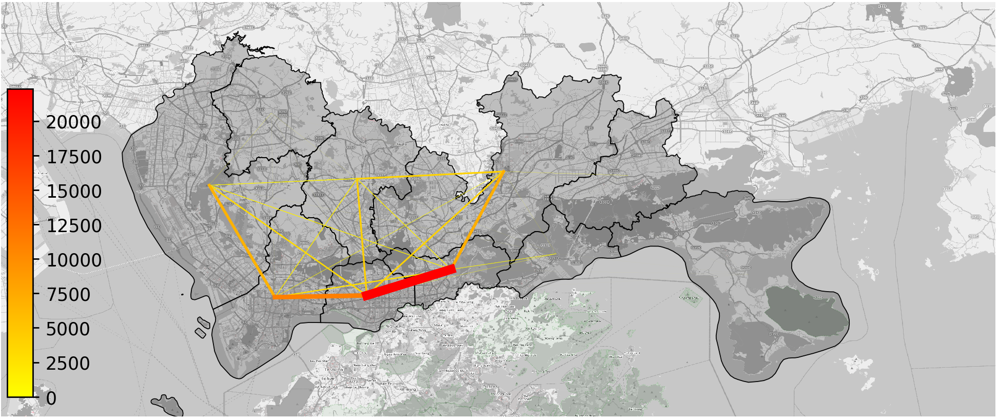
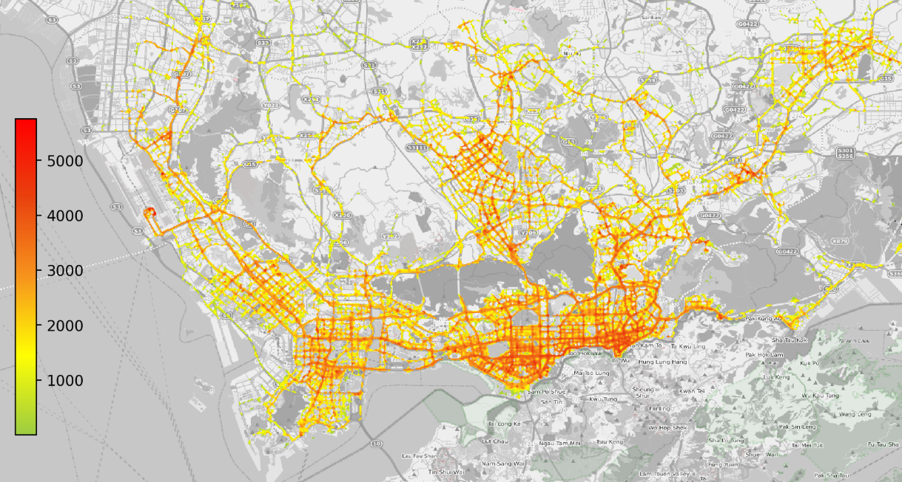
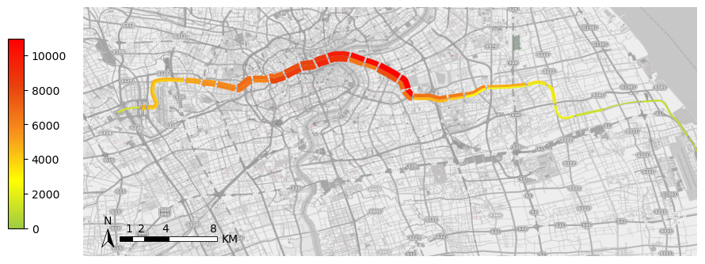
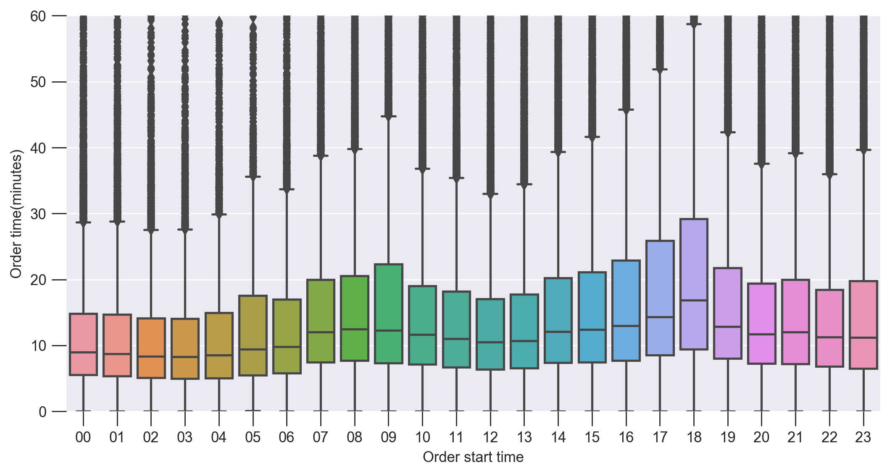
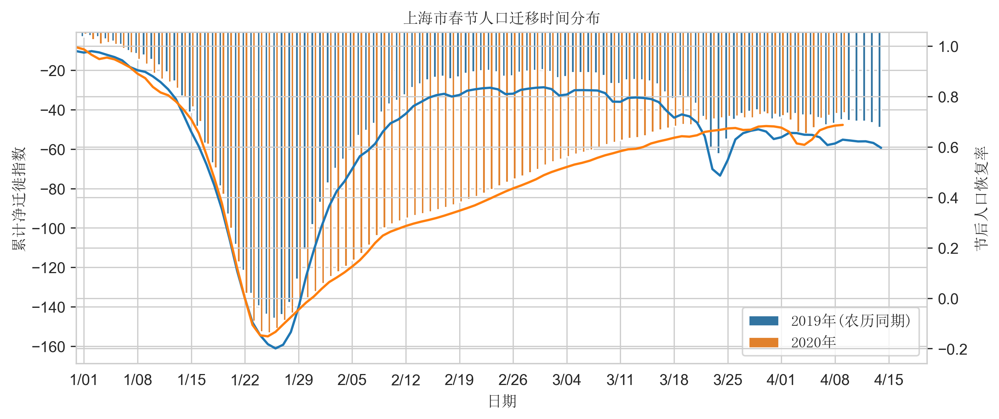

[English](README%20-%20en.md)  
本教程的b站视频地址：https://www.bilibili.com/video/BV1A5411a7xz  
本教程的github地址：https://github.com/ni1o1/pygeo-tutorial  
本教程的gitee地址(国内访问快)：https://gitee.com/ni1o1/pygeo-tutorial  
由于网速或者各种问题，网页打开本教程可能会出现图片或文件显示不能，因此建议各位下载教程到本地后用jupyter notebook打开教程观看  

# 如何使用本教程
本教程是在python的Jupyter notebook上编写，有些python的基础环境需要配置：  
1. Python环境: Python3.6/3.7均可，这里推荐装一个Anaconda，点击[这个链接](https://www.anaconda.com/distribution/)下载安装(Python是个编程语言，Anaconda是一个打包了数据分析常用功能的Python平台，安装Anaconda就已经包含Python本体)  
关于如何使用anaconda的Jupyter notebook可以看[这个链接](https://blog.csdn.net/m0_37438418/article/details/80620190)  
2. 把本教程搞到本地，点击本网页右上角的Clone or download，用git clone或者直接Download ZIP下载到本地。  
3. 安装本教程最核心的包：Python的geopandas包，点击[这个链接](https://geopandas.readthedocs.io/en/latest/install.html#installing-from-source)，按照上面的方法安装（比较推荐里面的Installing from source的方法安装）。  
4. 打开教程，enjoy！

# 教程目录
## 基础的数据处理
1. [出租车数据的基础处理，由gps生成OD（pandas）](1-taxigps_to_od.ipynb)  
2. [出租车数据的集计与基础图表绘制（matplotlib）](2-.ipynb)
3. [出租车数据的地理信息处理（geopandas）](3-.ipynb)  
4. [基于出租车GPS的OD期望线绘制与底图添加（plot_map）](4-.ipynb)  
5. [绘制数据分布的散点图和热力图（contourf）](5-.ipynb)  
6. [结构化数据的存储及处理的思维训练(理论课)](6-.ipynb)  
## 用python实现GIS处理
1. [轨道客流可视化！shapely初探](轨道客流可视化！shapely初探.ipynb)  
2. [用道路切分地块！shapely的线转面处理！](用道路切分地块！shapely的线转面处理！.ipynb)
3. [利用osmnx与plot_map计算并可视化街道方向_by_YuanLianggg](16-利用osmnx与plot_map计算并可视化街道方向.ipynb)

## 爬虫
1. [爬虫爬API抓取行政区划（urllib）](7-.ipynb)  
2. [抓抓抓包！用百度迁徙数据计算人口恢复率](8-.ipynb)  
3. [抓微博！微博评论关系可视化(微博api)](抓微博!微博评论关系可视化.ipynb)
## 可视化
1. [基于folium的可交互地图可视化(folium)](9-.ipynb)  
2. [基于pyecharts的可交互可视化(pyecharts)](10-.ipynb)  
3. [利用pandana可视化城市设施的可达性_by_fff2zrx](15-.ipynb)  
4. [好看又高大上的可视化pydeck入门](pydeck-getstart.ipynb)  
## 项目
1. [实战项目：怎么当一个优秀的出租车手-1](11-1.ipynb)  
2. [实战项目：怎么当一个优秀的出租车手-2](11-2.ipynb)  
## 学术课  
1. [主成分分析PCA的原理、实现、缺陷及改进](12-.ipynb)  
2. [谱聚类的原理及实现](13-.ipynb)  
3. [基于自表达性的深度子空间聚类](14-.ipynb)  
4. [社区发现！Fast unfolding算法分析出租车社区](Fastunfolding.ipynb)

# 教程说明
大数据时代到来，随着数据的逐步开放，数据工作者们或多或少都要接触到时空数据。  
>小旭学长曾经说：The data is data since it's data.  

是的！数据处理是一门艺术！在处理时空数据的时候，你不仅要数据处理，还需要会GIS，最重要的它是一门艺术，要用你的审美，要出很好看的可视化图！  

以前，我要用sql数据库处理数据，导出到excel画图表，再导出到arcgis出图，一套流程下来得开好几个软件，工作效率极低。  

>上次老师跟我说：小旭啊，我们这个项目你给我出800张图吧，我这周五就要。这个其实画出来也没什么用，主要是想放我们项目文本的附录里显示我们的工作量  
我当场把桌子掀起来，画你妹！老子这博不读了  
不，以上是做梦，现实情况是: 我微笑着说，好的老师，我通宵画  

现在，python出现了，有了python里面的pandas，geopandas，matplotlib包，只需要用python就能实现数据的批量计算，批量出gis图等等。  

哇！太棒了！简直是读研、读博、设计院画图、数据分析、闲着没事、居家旅行时候都必须会的技能，别说800张图了，电脑空间有多少我就能生成多少图，包您满意

通过本教程，你将从头开始，会学到一些时空数据的处理技巧，用python进行数据清洗，数据集计，数据整合，可视化！教程的后半段介绍了几个常用的python可视化包，最后是实战项目  

本教程的可视化效果图展示  

# 使用数据
本教程的数据来源（公开数据集可直接下载）：  
[深圳出租车数据](https://www.cs.rutgers.edu/~dz220/data.html)  
Urban Data Release V2  
Taxi GPS Data Format: 22223,2013-10-22 08:49:25,114.116631,22.582466,0  
Taxi ID, Time, Latitude, Longitude, Occupancy Status, Speed; Occupancy Status: 1-with passengers & 0-with passengers;  
    
# 学习本教程需要的基础
在学习本教程之前，强烈建议各位已经掌握了python的最基础的编程语法。如果你还没有掌握，下面建议你完成：

[小甲鱼的python入门视频（看到35P）](https://www.bilibili.com/video/av27789609?from=search&seid=5111701058031824734)  

另外，推荐课程：

1. [imooc的Python数据分析-基础技术篇教程](https://www.imooc.com/learn/843)
2. [udacity的数据分析入门课程](https://classroom.udacity.com/courses/ud170/)
3. [coursera的机器学习课程](https://www.coursera.org/learn/machine-learning)
4. [莫烦PYTHON的pytorch动态神经网络课程](https://morvanzhou.github.io/tutorials/machine-learning/torch/)

# 友情链接
[小旭学长的Echarts作品](https://gallery.echartsjs.com/explore.html?u=bd-167860219&type=work#sort=rank~timeframe=all~author=all)

# 贡献者
<h3 class="border-bottom p-2 lh-condensed"><a data-hovercard-type="user" data-hovercard-url="/users/ni1o1/hovercard" class="text-normal" href="https://github.com/ni1o1">ni1o1</a></h3>
<h3 class="border-bottom p-2 lh-condensed"><a data-hovercard-type="user" data-hovercard-url="/users/fff2zrx/hovercard" class="text-normal" href="https://github.com/fff2zrx">fff2zrx</a></h3>
<h3 class="border-bottom p-2 lh-condensed"><a data-hovercard-type="user" data-hovercard-url="/users/YuanLianggg/hovercard" class="text-normal" href="/YuanLianggg">YuanLianggg</a></h3>
